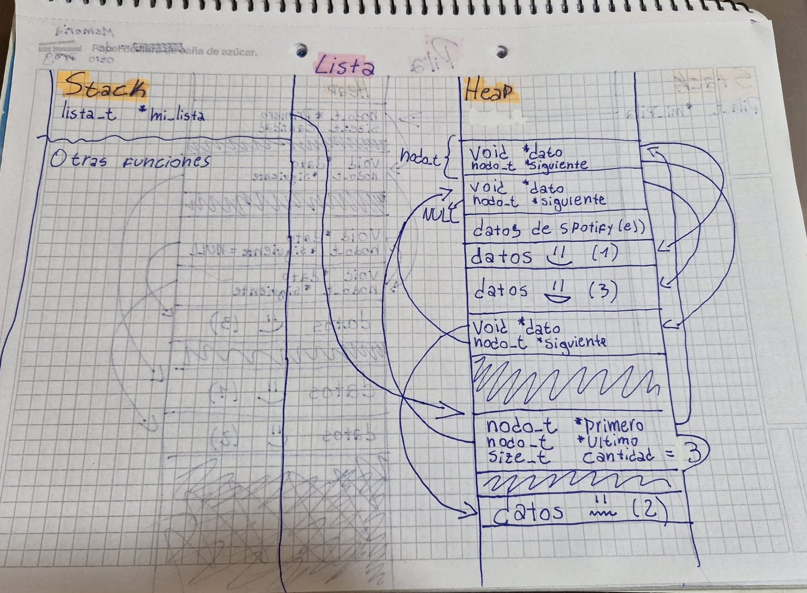
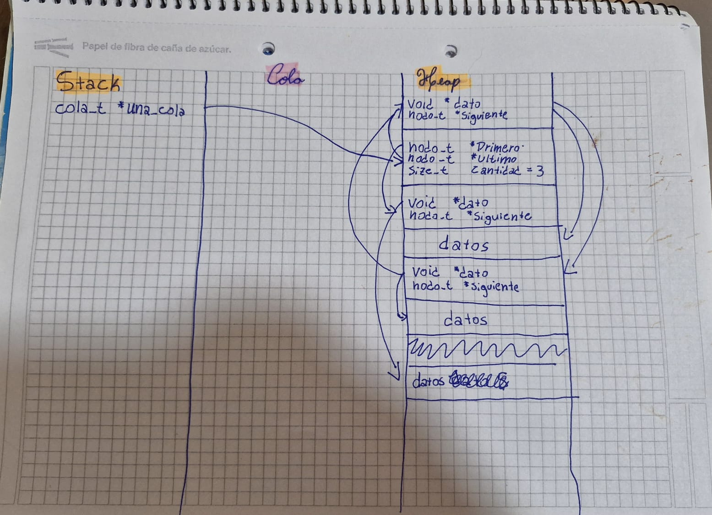
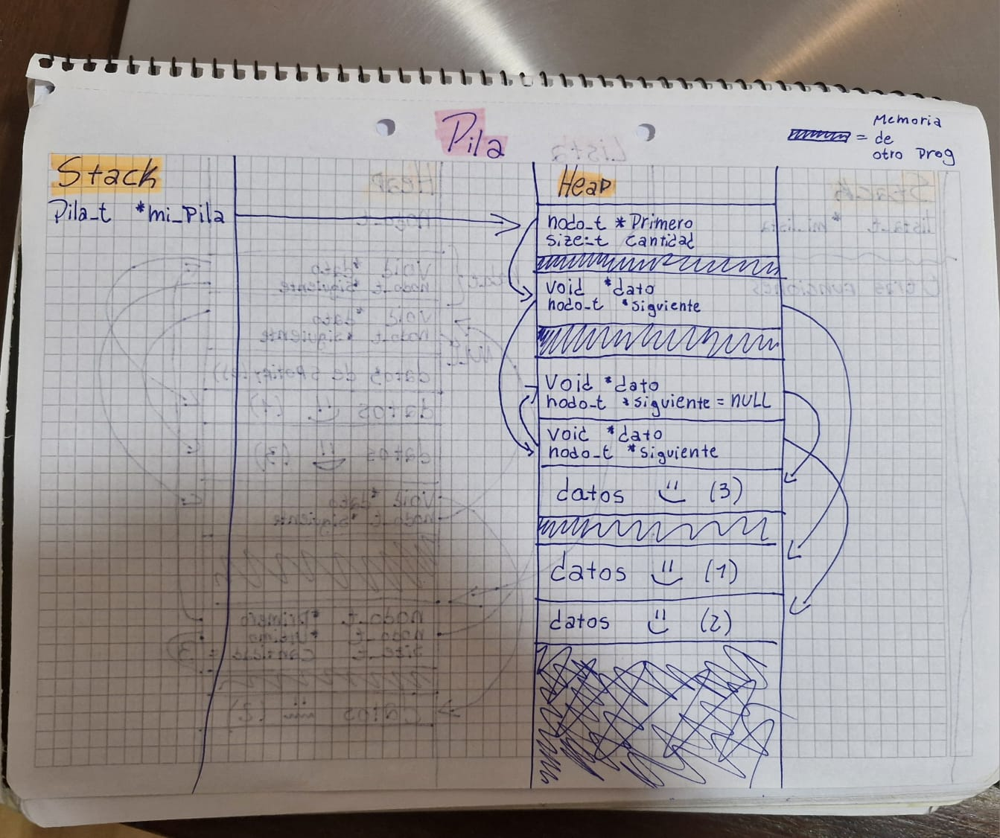

<div align="right">

</div>

# TDA LISTA/PILA/COLA

## Repositorio de Timoteo Argibay - 113678 - targibay@fi.uba.ar

- Para compilar:

```bash
make main_compilar
```

- Para ejecutar:

```bash
./main {comandos}
```

- Para ejecutar con valgrind:
```bash
make valgrind_main
make valgrind_pruebas
```
---
##  Funcionamiento
Basicamente, para lista, se creo una estructura adicional nodo (nodo_t) donde se guardan dos punteros, uno al siguiente elemento y otro hacia la informacion correspondiente, la estructura lista posee un puntero al primer nodo, al ultimo y un size_t con la cantidad total de nodos, cada funcion hace lo pedido, en el main al abrir el programa se lee el archivo pasado por linea de comandos y luego se lo copia completamente a la lista (es decir, son elementos nuevos y los punteros de lista no apuntan a los datos de el struct tp1_t, esto fue adrede con la intencion de que no haya problemas de liberacion de memoria y para demostrar que el funcionamiento es genuinamente de la lista y no de el struct tp1

## Diagrama de memoria de lista clasica
<div align="center">

</div>

## Diagrama de memoria de cola
<div align="center">

</div>

## Diagrama de memoria de pila
<div align="center">

</div>

##
Explicación de cómo funcionan las estructuras desarrolladas en el TP y el funcionamiento general del mismo.

Aclarar en esta parte todas las decisiones que se tomaron al realizar el TP, cosas que no se aclaren en el enunciado, fragmentos de código que necesiten explicación extra, etc.

Incluir **EN TODOS LOS TPS** los diagramas relevantes al problema (mayormente diagramas de memoria para explicar las estructuras, pero se pueden utilizar otros diagramas si es necesario).

### Por ejemplo:

El programa funciona abriendo el archivo pasado como parámetro y leyendolo línea por línea. Por cada línea crea un registro e intenta agregarlo al vector. La función de lectura intenta leer todo el archivo o hasta encontrar el primer error. Devuelve un vector con todos los registros creados.

<div align="center">

</div>

En el archivo `sarasa.c` la función `funcion1` utiliza `realloc` para agrandar la zona de memoria utilizada para conquistar el mundo. El resultado de `realloc` lo guardo en una variable auxiliar para no perder el puntero original en caso de error:

```c
int *vector = realloc(vector_original, (n+1)*sizeof(int));

if(vector == NULL)
    return -1;
vector_original = vector;
```


<div align="center">

</div>

---

## Respuestas a las preguntas teóricas
Incluír acá las respuestas a las preguntas del enunciado (si aplica).

1) Una lista es un TDA propiamente dicho, es una estructura que, frente a la problematica de que los mallocs para arrays piden memoria de 
forma continua (es decir, una tira de memoria ininterrumpida), en vez de hacer eso, se fragmenta en nodos, donde cada nodo poseé (en el caso
de lista simplemente enlazada) un puntero a la informacion que contiene y otro puntero hacia el siguiente nodo. La ventaja es que estos nodos
pueden estar separados entre sí entonces se puede usar mejor la memoria sin depender de sí o sí tener una tira continua de memoria, esto es util
para datos a gran escala, aunque no sea verdaderamente apreciable en trabajos de demostracion como este donde solo usamos un par de KB en el mejor
de los casos.

La unica diferencia entre la lista simplemente enlazada (mencionada recien) frente a una doblemente enlazada es que la D.E poseé tambien un 
puntero al elemento anterior, permitiendo iterar en los dos sentidos en lugar de solo hacia adelante.

La lista doblemente enlazada solo es util si tenes algun escenario donde necesites iterar hacia atrás, pero la simplemente enlazada es mas 
"barata" porque no tiene el puntero extra, y su implementacion es mas facil al no tener que modificar otro puntero

2) Una lista circular, no interfiere con su tipo de enlazamiento, asi que puede ser S.E o D.E como las mencionadas anteriormente, 
la particularidad de esta es que el ultimo nodo en vez de apuntar a NULL apunta al primero y, si es doblemente enlazada, el puntero al nodo
anterior del primer nodo, apunta al ultimo elemento, la ventaja principal de esto es que se puede iterar en un solo sentido indefinidamente sin
tener que volver al principio y/o reiniciar el iterador, teniendo especial cuidado con los loops while ya que si estos no cuentan el numero de
iteraciones, facilmente podes entrar a un loop infinito porque nunca vas a llegar a NULL

3) Las pilas y las colas son tipos especiales de listas, comunmente las listas tradicionales poseen un puntero al inicio, un puntero al final, su cantidad y no hay problemas si queres insertar elementos en posiciones especiales o eliminar un elemento arbitrariamente.

Ahora, cuando la lista es una Pila, se tiene que respetar si o sí el formato LIFO (como en el stack de ejecucion), donde el unico elemento que
podemos sacar de la pila es el ultimo que entro, y debemos desapilarlo si queremos llegar al final de la pila

Por otro lado, la cola si bien es parecida a la Pila, da un poco mas de libertades ya que, como la lista tradicional, tenemos un puntero al final
y su formato es (FIFO), es decir que el unico elemento que podemos sacar es el que esta al principio de la misma, al reves que en la pila.

Las principales diferencias de ambas frente a la lista es que no podemos iterar y modificar libremente los nodos, si queres llegar a los del medio
debes desapilar o desencolar obligatoriamente.

4) La diferencia entre iterador externo e interno es que el externo es otro tipo de dato separado de la lista que lleva un puntero al nodo actual, la posicion de la lista y se puede mover como le parezca al usuario, como en este TP con las funciones de lista_iterador, mientras que un 
iterador actual maneja las iteraciones por si solo y vos solo le decis que queres hacer, como pasarle una funcion y que se la aplique a cada
elemento, escencialmente dando menos libertades pero manteniendo la privacidad de la lista


